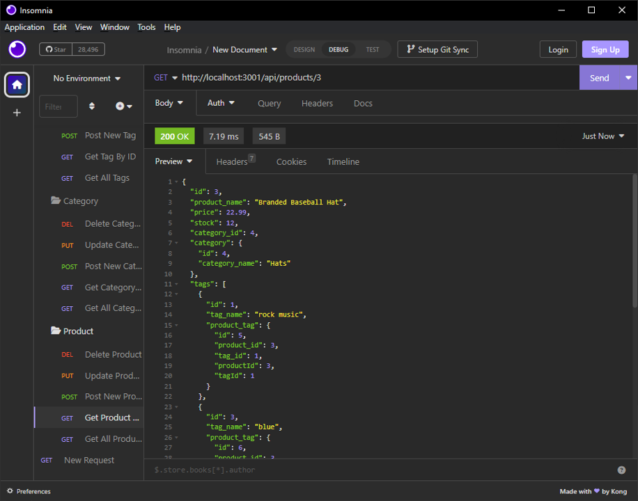

# E-Commerce-BE
12 Challenge

## Description

In this challenge, the provided code serves as a base for completing the task of creating an e-commerce API. The API is responsible for handling requests related to product information and its associated tags and categories. 

To handle the HTTP requests and responses, the code utilizes the `Express` framework, which provides a convenient way to create a server and define routes for handling different endpoints.

For interacting with the database, the code uses `Sequelize`, an Object-Relational Mapping (ORM) library for Node.js. Sequelize simplifies the process of working with databases by providing an abstraction layer and allowing developers to define models that correspond to database tables. 

By leveraging Sequelize's model instances, the server can retrieve, save, and execute commands on the database accurately, depending on the requested action. This allows the API to efficiently handle operations related to products, tags, and categories, ensuring the data is properly stored and retrieved as needed.

## User Story

```md
AS A manager at an internet retail company
I WANT a back end for my e-commerce website that uses the latest technologies
SO THAT my company can compete with other e-commerce companies
```

## Acceptance Criteria

```md
GIVEN a functional Express.js API
WHEN I add my database name, MySQL username, and MySQL password to an environment variable file
THEN I am able to connect to a database using Sequelize
WHEN I enter schema and seed commands
THEN a development database is created and is seeded with test data
WHEN I enter the command to invoke the application
THEN my server is started and the Sequelize models are synced to the MySQL database
WHEN I open API GET routes in Insomnia for categories, products, or tags
THEN the data for each of these routes is displayed in a formatted JSON
WHEN I test API POST, PUT, and DELETE routes in Insomnia
THEN I am able to successfully create, update, and delete data in my database
```


## Usage
### Set Up the Database
* Start a mysql command line
```
mysql> source schema.sql
```
### Seed the Database
Prefill the database with mock data.
```
> npm run seeds
```
### Start the Server
Start the server.
```
> npm start
```

## Database Structure
### Category
```
+---------------+--------------+------+-----+---------+----------------+
| Field         | Type         | Null | Key | Default | Extra          |
+---------------+--------------+------+-----+---------+----------------+
| id            | int          | NO   | PRI | NULL    | auto_increment |
| category_name | varchar(255) | NO   |     | NULL    |                |
+---------------+--------------+------+-----+---------+----------------+
```
### Tag
```
+----------+--------------+------+-----+---------+----------------+
| Field    | Type         | Null | Key | Default | Extra          |
+----------+--------------+------+-----+---------+----------------+
| id       | int          | NO   | PRI | NULL    | auto_increment |
| tag_name | varchar(255) | YES  |     | NULL    |                |
+----------+--------------+------+-----+---------+----------------+
```
### Product
```
+--------------+--------------+------+-----+---------+----------------+
| Field        | Type         | Null | Key | Default | Extra          |
+--------------+--------------+------+-----+---------+----------------+
| id           | int          | NO   | PRI | NULL    | auto_increment |
| product_name | varchar(255) | NO   |     | NULL    |                |
| price        | double       | NO   |     | NULL    |                |
| stock        | int          | NO   |     | NULL    |                |
| category_id  | int          | YES  | MUL | NULL    |                |
+--------------+--------------+------+-----+---------+----------------+
```
### Product Tag
```
+------------+------+------+-----+---------+----------------+
| Field      | Type | Null | Key | Default | Extra          |
+------------+------+------+-----+---------+----------------+
| id         | int  | NO   | PRI | NULL    | auto_increment |
| product_id | int  | YES  | MUL | NULL    |                |
| tag_id     | int  | YES  | MUL | NULL    |                |
+------------+------+------+-----+---------+----------------+
```
## Code
### Connection
This script creates a Connection to the database using the credentials from the .env file.
```js
const Sequelize = require('sequelize');
require('dotenv').config();
let sequelize;
if (process.env.JAWSDB_URL) {
  sequelize = new Sequelize(process.env.JAWSDB_URL);
} else {
  sequelize = new Sequelize(
    process.env.DB_NAME,
    process.env.DB_USER,
    process.env.DB_PASSWORD,
    {
      host: 'localhost',
      dialect: 'mysql',
      port: 3306
    }
  );
}
module.exports = sequelize;
```

### Model
**Index**
In the main script of the Model folder, it declares the relation to which Sequelize will interpret the data in the database.
```js
Category.hasMany(Product, {
    foreignKey: 'category_id'
});
Product.belongsTo(Category, {
    foreignKey: 'category_id'
});
Product.belongsToMany(Tag, {
    through: ProductTag
});
Tag.belongsToMany(Product, {
    through: ProductTag
});
```
**Category**
The Category class initializes a model that contains the description of what the table in the database will correspond to.
```js
Category.init(
    {
        id: {
            type: DataTypes.INTEGER,
            primaryKey: true,
            autoIncrement: true,
            allowNull: false,
        },
        category_name: {
            type: DataTypes.STRING,
            allowNull: false
        }
    },
    {
        sequelize,
        timestamps: false,
        freezeTableName: true,
        underscored: true,
        modelName: 'category'
    }
);
```
**Tag**
The Tag class initializes a model that contains the description of what the table in the database will correspond to.
```js
Tag.init(
    {
        id: {
            type: DataTypes.INTEGER,
            allowNull: false,
            primaryKey: true,
            autoIncrement: true
        },
        tag_name:{
            type:DataTypes.STRING
        }
    },
    {
        sequelize,
        timestamps: false,
        freezeTableName: true,
        underscored: true,
        modelName: 'tag'
    }
);
```
**Product**
The Product class initializes a model that contains the description of what the table in the database will correspond to, as well as the table and column to which the referenced value will refer.
```js
Product.init(
    {
        id: {
            type: DataTypes.INTEGER,
            primaryKey: true,
            autoIncrement: true,
            allowNull: false,
        },
        product_name: {
            type: DataTypes.STRING,
            allowNull: false
        },
        price: {
            type: DataTypes.DOUBLE,
            allowNull: false,
            validate: {
                isDecimal: true,
            },
        },
        stock: {
            type: DataTypes.INTEGER,
            allowNull: false,
            validate: {
                isInt: true
            }
        },
        category_id: {
            type: DataTypes.INTEGER,
            references: {
                model: 'category',
                key: 'id',
            }
        }
    },
    {
        sequelize,
        timestamps: false,
        freezeTableName: true,
        underscored: true,
        modelName: 'product'
    }
);
```
**Product Tag**
The ProductTag class initializes a model that contains the description of what the table in the database will correspond to. This table is used to create a relation between products and tags, where one tag can belong to many products, and many products can belong to many tags.

```js
ProductTag.init(
    {
        id: {
            type: DataTypes.INTEGER,
            allowNull: false,
            primaryKey: true,
            autoIncrement: true
        },
        product_id: {
            type: DataTypes.INTEGER,
            references: {
                model: "product",
                key: "id"
            }
        },
        tag_id: {
            type: DataTypes.INTEGER,
            references: {
                model: "tag",
                key: "id"
            }
        }
    },
    {
        sequelize,
        timestamps: false,
        freezeTableName: true,
        underscored: true,
        modelName: 'product_tag'
    }
);
```


### Seeds
The main script call for individual function that will insert data to their specific table in the database.
```js
const seedAll = async () => {
  await sequelize.sync({ force: true });
  await seedCategories();
  await seedProducts();
  await seedTags();
  await seedProductTags();
  process.exit(0);
};
seedAll();
```
**Example** 
The script structure to seed a table has a JSON variable with mock data that will be input into the table.
```js
const categoryData = [
  { category_name: 'Shirts',},
  { category_name: 'Shorts', },
  { category_name: 'Music', },
  { category_name: 'Hats', },
  { category_name: 'Shoes', },
];
```
Then it call to the function that fill create the entries. This is done with the sequelize function bulkCreate which along with a json variable it fills the table to which method corresponds.
```js
const seedCategories = () => Category.bulkCreate(categoryData);
```

### Server - Routes
To start, the main script initializes the Express server and uses routes to redirect the requests to the routes folder, which will handle the HTTP requests accordingly.

```js
const express = require('express');
const routes = require('./lib/routes');

const app = express();
const PORT = process.env.PORT || 3001;

app.use(express.json());
app.use(express.urlencoded({ extended: true }));

app.use(routes);
app.listen(PORT, () => {
  console.log(`App listening on port ${PORT}!`);
});
```
### Index - Router
<sub style='font-weight: bold;'>* The next sections will not show in-depth code for the HTTP request but only the Sequelize functions used to accomplish the desired action.</sub>

This script will handle every HTTP request sent to the route folder. If the request is made to the `/api` route, it will be redirected to the API folder router.
```js
router.use('/api', apiRoutes);
router.use((req, res) => {
  res.send("<h1>Wrong Route!</h1>")
});
```
At the `/api` route the next router will handle the requets and reroute the request to the correct route to each one the routes.
```js
router.use('/categories', categoryRoutes);
router.use('/products', productRoutes);
router.use('/tags', tagRoutes);
```

### API - Category
Depending on the http request, each of the functions will performe a different set of instructions. 
* `Get`: this will return all or one by id function, it will include an array of product under that category.
* `Post`: will insert a new entry using the request body.
* `Put`: will update an existing entry from the table using ID and update its info with the request body.
* `Delete`: will delete an entry using a parameter from the request.

Get All
```js
const CategoryData = await Category.findAll({
    include: [{ model: Product }]
});
```
Get By ID
```js
const CategoryData = await Category.findByPk(req.params.id, {
    include: [{ model: Product }]
});
```
Post
```js
const CategoryData = await Category.create(req.body);
```
Update
```js
const CategoryData = await Category.update(
    req.body, { where: { id: req.params.id } }
);
```
Delete By ID
```js
const CategoryData = await Category.destroy({
    where: { id: req.params.id }
});
```

### API - Tag
Depending on the http request, each of the functions will performe a different set of instructions. 
* `Get`: this will return all or one by id function, it will include an array of product under that tag.
* `Post`: will insert a new entry using the request body.
* `Put`: will update an existing entry from the table using ID and update its info with the request body.
* `Delete`: will delete an entry using a parameter from the request.

Get All
```js 
const TagData = await Tag.findAll({
    include: [{ model: Product }]
});
```
Get By ID
```js 
const TagData = await Tag.findByPk(req.params.id, {
    include: [{ model: Product }]
})
```
Post
```js 
const TagData = await Tag.create(req.body);
```
Update
```js 
const TagData = await Tag.update(
    req.body, { where: { id: req.params.id } }
);
```
Delete By ID
```js 
const TagData = await Tag.destroy({
    where: { id: req.params.id }
});
```
### API - Product

Depending on the http request, each of the functions will performe a different set of instructions. 
* `Get`: this will return all or one by id function, it will include an array for each Tags and Categories to which the product belongs.
* `Post`: will insert a new entry using the request body.
* `Put`: will update an existing entry from the table using ID and update its info with the request body.
* `Delete`: will delete an entry using a parameter from the request.

Get All
```js
const ProductData = await Product.findAll({
    include: [{ model: Category }, { model: Tag }]
});
```
Get By ID
```js 
const ProductData = await Product.findByPk(req.params.id, {
    include: [{ model: Category }, { model: Tag }]
});
```
Post
```js
const ProductData = await Product.create(req.body)
    .then((product) => {
    if (req.body.tagIds.length) {
        const productTagIdArr = req.body.tagIds.map((tag_id) => {
        return {
            product_id: product.id,
            tag_id, };
        });
        return ProductTag.bulkCreate(productTagIdArr);
    }
});
```
Update
```js
const ProductData = await Product.update(req.body, {
    where: {
    id: req.params.id,
    }
})
```
Delete By ID
```js 
const ProductData = await Product.destroy({
    where: { id: req.params.id }
});
```

## Screenshots
### Tag


### Category


### Product



## Video
<sub style='font-weight: bold;'>* This is a preview. Click to watch full video.</sub>
[](https://1drv.ms/v/s!Asj9JhD05ulbswGw2OSqWZ-qPWOj?e=hcGtvg)
